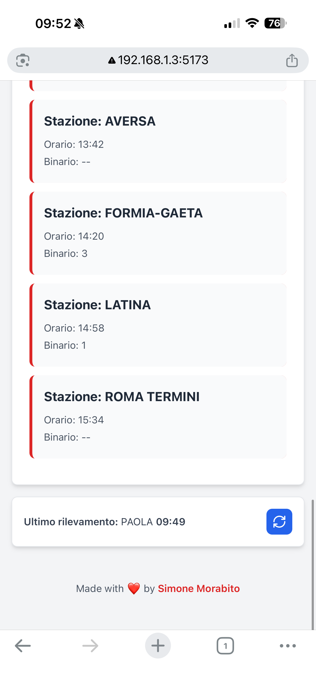

# TrovaTreno 🚂
Tracker treni per l'Italia. Veloce, semplice e senza pubblicità.

## Features
- ✅ Backend API funzionante
- ✅ Ricerca treno per numero
- ✅ Dati real-time da ViaggiaTreno
- ✅ Frontend React completo
- ✅ Visualizzazione fermate e ritardi
- ✅ Design mobile-responsive
- ✅ Evidenziazione fermata attuale
- ✅ Aggiornamento dati in tempo reale

## Setup

### Backend
```bash
cd server
npm install
node index.js
```

Server su `http://localhost:4040`

### Frontend
```bash
cd client
npm install
npm run dev
```

App su `http://localhost:5173`

### API Endpoint
```
GET /api/search/:trainNumber
```

**Esempio:**
```
http://localhost:4040/api/search/21908
```

**Risposta:** Informazioni complete con fermate, ritardi, binari e ultimo rilevamento.

## Tech Stack
- **Backend:** Node.js, Express, Axios
- **Frontend:** React, TailwindCSS, Vite, Lucide React
- **API:** ViaggiaTreno (Trenitalia)

## Screenshots



## Contributing

Contributi, issues e feature requests sono benvenuti!

Sentiti libero di controllare la [issues page](https://github.com/tuousername/trovatreno/issues).

### Come contribuire

1. Fai il fork del progetto
2. Crea il tuo feature branch (`git checkout -b feature/AmazingFeature`)
3. Committa le tue modifiche (`git commit -m 'Add some AmazingFeature'`)
4. Pusha sul branch (`git push origin feature/AmazingFeature`)
5. Apri una Pull Request

Tutte le PR saranno revisionate prima del merge.

## License

Questo progetto è [MIT](LICENSE) licensed.

---
Made with ❤️ by [Simone](https://simonemorabito.dev)